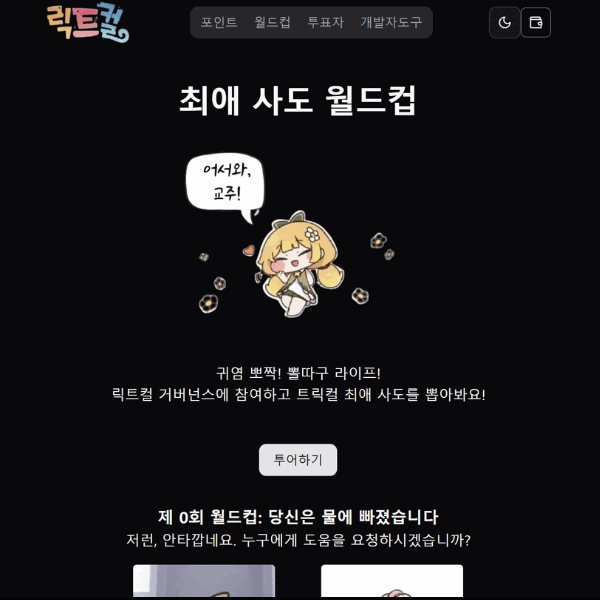
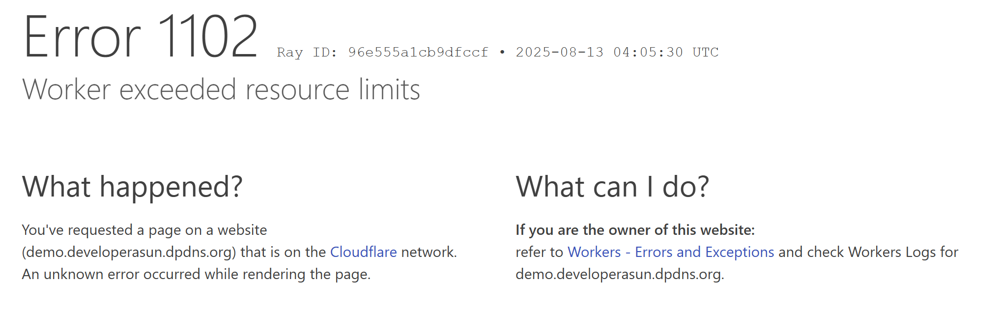
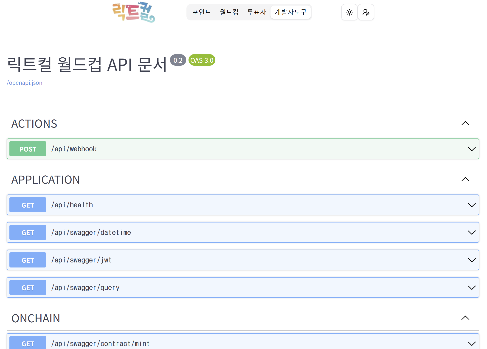

# Table of contents

- [프로젝트 개요](#프로젝트-개요)
- [데모](#데모)
- [설계-의도](#설계-의도)
- [기술-스택](#기술-스택)
- [피쳐-리스트](#피쳐-리스트)
- [실행테스트-환경](#실행테스트-환경)
- [레퍼런스](#레퍼런스)

## 프로젝트 개요

- 당신의 최애 사도는 누구인가요? 릭트컬 거버넌스에 참여하여 최애 사도 월드컵을 만들고 친구들에게 공유해보세요!

<div align="center">



</div>

## 데모

_caution_

클라우드플레어 워커 free 플랜 리소스 사용량에 따라 접근이 잠시 불가할 수도 있습니다.

<div align="center">



</div>

- https://worldcup.developerasun.dpdns.org

## 설계 의도

| 항목        | 설명                                                                                                                                                     |
| ----------- | -------------------------------------------------------------------------------------------------------------------------------------------------------- |
| 지속 가능성 | 대부분의 사이드 프로젝트는 배포 후 몇 주 내에 종료됨. 이를 방지하기 위해 **초기부터 장기 유지 가능한 구조**로 설계함                                     |
| 보안 대응   | 배포 직후부터 자동화된 봇 및 AI 크롤러 공격이 들어오기 때문에, **적절한 보안 요소를 배치**해야 함                                                        |
| UX 간결성   | 블록체인 UX는 본질적으로 복잡함. 트랜잭션 실패, 가스비, 니모닉 등 **사용자는 신경 쓰고 싶어하지 않음**. 블록체인 요소는 감추고 UX는 단순하게 구성해야 함 |

---

## 기술 스택

### 👨‍💻 클라이언트 & 서버

| 영역              | 기술                        |
| ----------------- | --------------------------- |
| 풀스택 프레임워크 | `Next.js`                   |
| UI 구성           | `shadcn/ui`, `Tailwind CSS` |
| 배치 작업 (크론)  | `GitHub Actions`            |

---

### 🔗 블록체인

| 영역            | 기술                               |
| --------------- | ---------------------------------- |
| 네트워크        | L1 `Ethereum Sepolia`              |
| 스마트 컨트랙트 | `Hardhat`, `Mocha`, `OpenZeppelin` |

---

### ☁️ 인프라

| 항목          | 설명                               |
| ------------- | ---------------------------------- |
| 도메인 등록처 | `DigitalPlat`                      |
| 네임서버      | `Cloudflare DNS`                   |
| 방화벽        | `Cloudflare WAF`, `Bot Fight Mode` |

---

### 🚀 배포

| 항목            | 설명                                                                                                              |
| --------------- | ----------------------------------------------------------------------------------------------------------------- |
| 서버리스 플랫폼 | `Cloudflare Workers`                                                                                              |
| 시크릿 관리     | [Cloudflare Wrangler Secrets](https://developers.cloudflare.com/workers/configuration/secrets/#via-wrangler) 사용 |

---

### 🗃 데이터베이스

| 항목    | 기술                                                                                                                 |
| ------- | -------------------------------------------------------------------------------------------------------------------- |
| DB 엔진 | `Cloudflare D1 (SQLite3 기반)`                                                                                       |
| ORM     | [`Drizzle ORM`](https://orm.drizzle.team/docs/connect-cloudflare-d1#step-2---initialize-the-driver-and-make-a-query) |

## 피쳐 리스트

### 🧩 사용자 기능 (웹2 기반)

| 기능                      | 설명                           |
| ------------------------- | ------------------------------ |
| 라이트/다크 모드 설정하기 | 사용자 테마 설정 지원          |
| 로그인/로그아웃           | 쿠키 기반 인증 처리            |
| 월드컵 생성 및 참여       | 게시글 생성 및 확인하기        |
| 현재 월드컵 상황 보기     | 실시간 진행 상태 확인          |
| 내 프로필 페이지 확인하기 | 내 정보 및 히스토리 조회       |
| 전체 투표자 확인하기      | 가입 유저 히스토리 조회하기    |
| 자주 묻는 질문 확인하기   | 서비스 가이드 제공             |
| 온보딩 투어 사용하기      | 참여형 초보자용 가이드 제공    |
| 인앱 메시지 확인하기      | 월드컵 승자 보상 안내 조회하기 |

### 🧩 블록체인 기능 (웹3 연동)

| 기능                                 | 설명                                    |
| ------------------------------------ | --------------------------------------- |
| 내 블록체인 지갑 생성하기            | 자체 지갑 생성 기능                     |
| 지갑으로 로그인하기 _(experimental)_ | 패스키(니모닉)을/를 통한 인증           |
| 엘리프 발급 트랜잭션 연동하기        | 블록체인에 ERC20 토큰 발급              |
| 월드컵 투표 트랜잭션 연동하기        | 투표 내역 블록체인 기록                 |
| 지갑으로 내 투표 내용 서명하기       | 전자 서명으로 투표 위/변조 방지         |
| 엘리프 투표권 사용해서 투표하기      | 전자 서명 및 토큰 소각을 통한 투표 기능 |
| 내 포인트/엘리프 잔고 확인하기       | 내 자산 조회하기                        |

### 🧩 개발자 기능 (백그라운드)

| 기능                              | 설명                                                                                                                                         |
| --------------------------------- | -------------------------------------------------------------------------------------------------------------------------------------------- |
| 월드컵 시작/종료하기              | [깃허브 액션: cron-proposal.yaml](https://github.com/developerasun/ricktcal-worldcup/blob/dev/.github/workflows/cron-proposal.yaml)로 자동화 |
| 월드컵 보상 부여하기              | [깃허브 액션: cron-reward.yaml](https://github.com/developerasun/ricktcal-worldcup/blob/dev/.github/workflows/cron-reward.yaml)로 자동화     |
| 미확인 블록체인 트랜잭션 추적하기 | [깃허브 액션: cron-pending.yaml](https://github.com/developerasun/ricktcal-worldcup/blob/dev/.github/workflows/cron-pending.yaml)로 자동화   |
| 데이터베이스 백업하기             | 로컬/프로덕션 환경 백업 지원                                                                                                                 |

### TODO

- 미확인 트랜잭션 존재 시 추가 투표/엘리프 교환 요청 비활성하기

## 실행/테스트 환경

### _development_

nextjs 로컬 https, 프로덕션 쿠키 옵션 모킹

```sh
# package.json
"dev": "next dev --turbopack --experimental-https",

# run
pnpm dev
```

[next-swagger-doc](https://github.com/jellydn/next-swagger-doc), 스웨거 api 테스트

```sh
# move to /apidoc page, required api key on production
```

<div align="center">



</div>

데이터베이스 마이그레이션(로컬 sqlite3 파일 생성 및 싱크)

```sh
# package.json
"db:schema": "pnpm exec drizzle-kit generate",
"db:local": "wrangler d1 execute ricktcal-db --remote --file=./src/server/database/migrations/0003_wet_energizer.sql",

# run schema gen
pnpm db:schema

# run schema migration
pnpm db:local
```

데이터베이스 백업 및 복구(sqlite3 외래키 순서 충돌 방지 => 스키마, 데이터 분리 처리)

```sh
# export current schema and then data
pnpm db:local:backup

# import the exported schema and then data
pnpm db:local:restore
```

### _stage_

워커 배포 환경 모킹, 스테이징. 빌드 에러 확인 및 프로덕션 배포 전 점검

```sh
pnpm preview
```

### _production_

_development_ 와 동일하게 데이터베이스 백업, 복구, 그리고 마이그레이션을 필요시 진행.

데이터베이스 백업 및 복구(sqlite3 외래키 순서 충돌 방지 => 스키마, 데이터 분리 처리)

서버 배포 처리

```sh
# package.json
"dep": "opennextjs-cloudflare build && opennextjs-cloudflare deploy",

# run
pnpm dep
```

### _onchain_

- [별도 문서화](https://github.com/developerasun/ricktcal-worldcup/blob/dev/blockchain/README.md)

## 레퍼런스

- [cloudflare docs: worker framework guide: nextjs](https://developers.cloudflare.com/workers/framework-guides/web-apps/nextjs/)
- [cloudflare docs: d1 getting started](https://developers.cloudflare.com/d1/get-started/)
- [github: TypeORM with Next.JS example project](https://github.com/gladykov/typeorm-next.js)
- [cloudflare docs: Hyperdrive](https://developers.cloudflare.com/hyperdrive/)
- [github: sign in with ethereum](https://github.com/spruceid/siwe)
- [root wallet tx history: ethereum sepolia](https://sepolia.etherscan.io/address/0xb052cabd197fd9ca9a0a1dc388b25e7326f28439)
- [eth faucet for test](https://cloud.google.com/application/web3/faucet)
- [cloudflare d1 docs: Billing metrics](https://developers.cloudflare.com/d1/platform/pricing/#billing-metrics)
- [cloudflare d1 docs: Import and export data](https://developers.cloudflare.com/d1/best-practices/import-export-data/#export-an-existing-d1-database)
