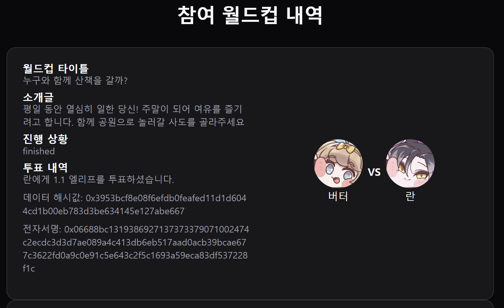
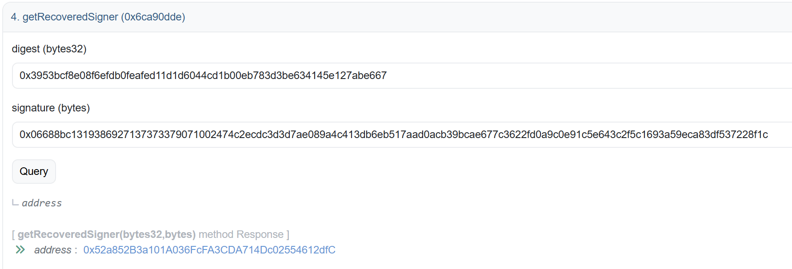
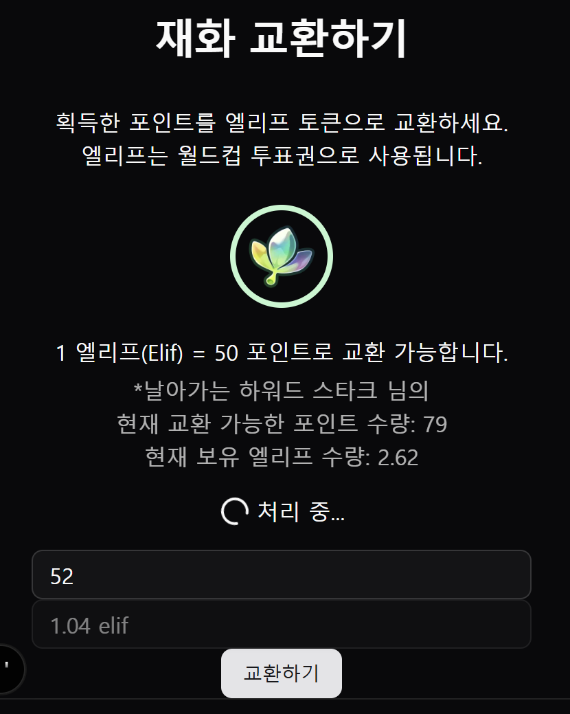
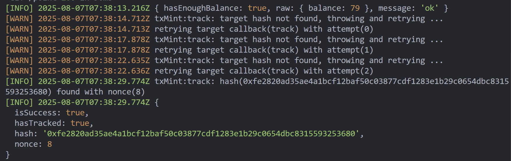

# Table of contents

- [스마트-컨트랙트-개요](#스마트-컨트랙트-개요)
- [피쳐](#피쳐)
- [실행/테스트 환경](#실행테스트-환경)
- [관리자-지갑-주소-리스트](#관리자-지갑-주소-리스트)
- [컨트랙트-주소-리스트](#컨트랙트-주소-리스트)

## 스마트 컨트랙트 개요

- _프로덕션 가스비 회피를 위해 **테스트넷**만 활용합니다._
- 릭트컬 월드컵 서버/데이터베이스에 저장된 투표 내역을 [공개적으로 검증](https://sepolia.etherscan.io/address/0xa37214781e180e5ad4223df36927d0867bdedd85#readContract#F4)합니다.

- 릭트컬 월드컵 재화로 사용되는 엘리프 토큰을 발급하고 소각합니다.
- 트랜잭션 요청 시 클라이언트에서 `로딩/펜딩 스피너`가 표시됩니다. 요청 종료 시 스피너가 사라집니다.
- 트랜잭션 요청 실패 시 `지수 백오프`로 7회 재시도합니다.
- 트랜잭션을 성공적으로 요청(브로드캐스팅) 했을 경우, 지수 백오프로 7회 트랜잭션 `성공 여부를 확인`합니다.

- 트랜잭션이 성공(네트워크에서 블록에 포함시켰을 경우)했을 경우, 트랜잭션 영수증을 파싱하여 데이터베이스에 `해시값`과 `논스값`이 등록됩니다.

## 피쳐

- 엘리프 토큰 발급/소각/전송하기
- 내 전자서명 검증하기
- 내 투표 기록 블록체인에 남기기
- 내 투표 기록 확인하기

### TODO

- ERC20 업그레이더블 패턴 도입하기
- `version` 메소드 추가하기

## 실행/테스트 환경

TBD

## 관리자 지갑 주소 리스트

- [0xB052caBD197Fd9CA9A0a1dc388b25e7326f28439](https://sepolia.etherscan.io/address/0xb052cabd197fd9ca9a0a1dc388b25e7326f28439)

## 컨트랙트 주소 리스트

_dev_

- [0xa37214781E180E5ad4223Df36927D0867BdeDd85](https://sepolia.etherscan.io/address/0xa37214781E180E5ad4223Df36927D0867BdeDd85)

_prod_

TBD
